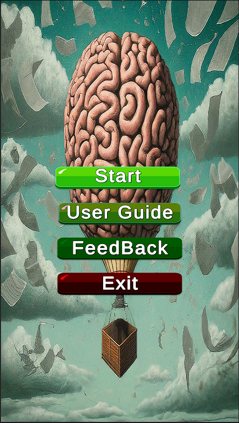
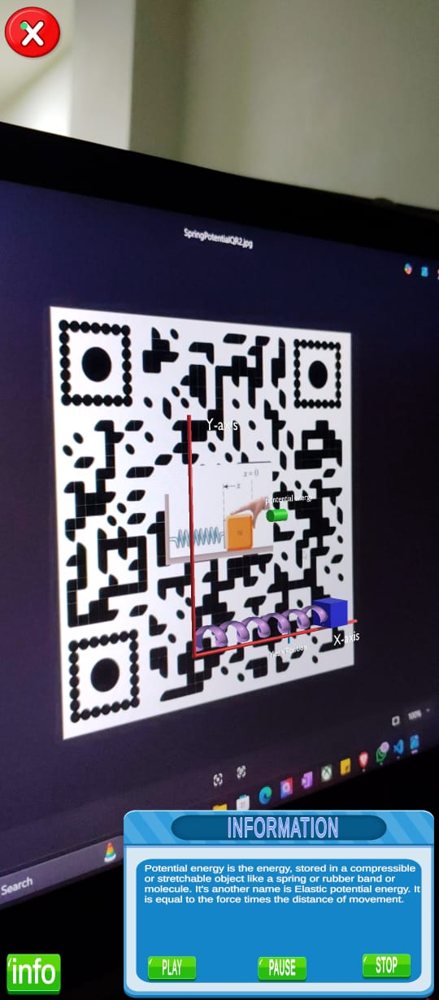
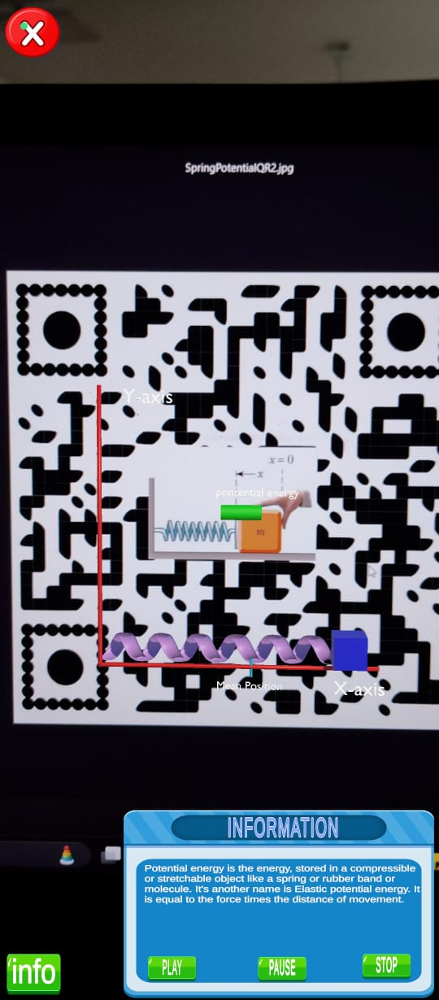

# 📱 ARPhysics – Augmented Reality for Physics Education

## 📖 Abstract  
Augmented Reality (AR) has emerged as a transformative technology reshaping education by offering immersive experiences that bridge theoretical concepts with practical understanding. **ARPhysics** is an innovative AR-based application designed to enhance the teaching and learning of physics concepts through interactive 3D models and engaging educational content.  

The goal of ARPhysics is to:  
- Provide a dynamic and immersive learning environment.  
- Bridge the gap between theoretical concepts and practical comprehension.  
- Improve analytical skills, especially in **elementary school settings**.  

With ARPhysics, students can explore and understand topics such as:  
- ⚡ Conservation of Kinetic Energy  
- 🌀 Components of Forces in different types of motion  
- 🌊 Wave Kinetics  
- 🪀 Energy Conservation in Springs  

Through experimental evaluation, students demonstrated significant improvement in understanding and retention of physics principles compared to traditional learning methods. This project highlights AR’s potential to **reshape the future of physics education**.  

---

## 🛠️ Tools & Technologies  

- **Blender** – 3D Modeling  
- **Unity** – Game Development & AR integration  
- **Firebase** – User Authentication  
- **Google Forms** – Collecting User Reviews & Feedback  

---

## 🚀 Features  

- 📱 Immersive AR-based Physics Simulations  
- 🎓 Interactive 3D Models of Physics Concepts  
- 🔐 Secure Firebase Authentication  
- 📝 Feedback Collection via Google Forms  
- 🧩 Engaging and Easy-to-Understand Visualizations  

---

## 📷 Demo Screenshots  

1. **Login Page**  
     

2. **SignUp Page**  
     

3. **Home Page**  
     

4. **Feedback Form**  
     

5. **Demo**  
     

6. **Demo**  
     

---

## 📂 Project Structure  

